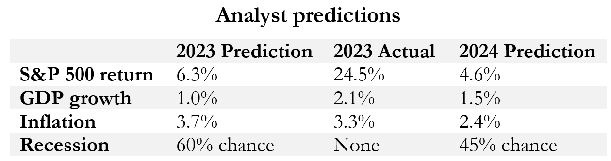
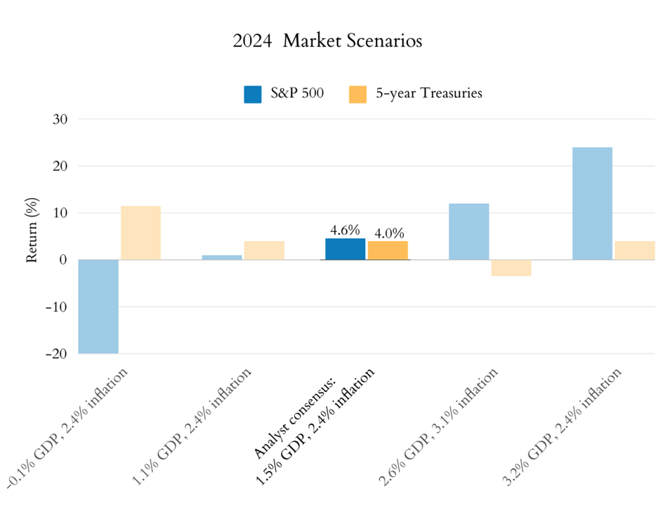
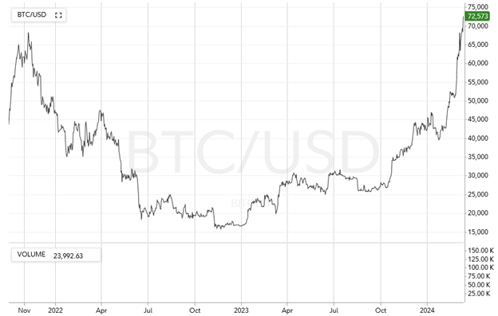
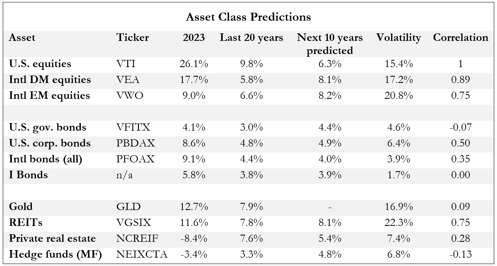
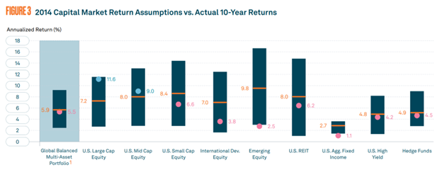
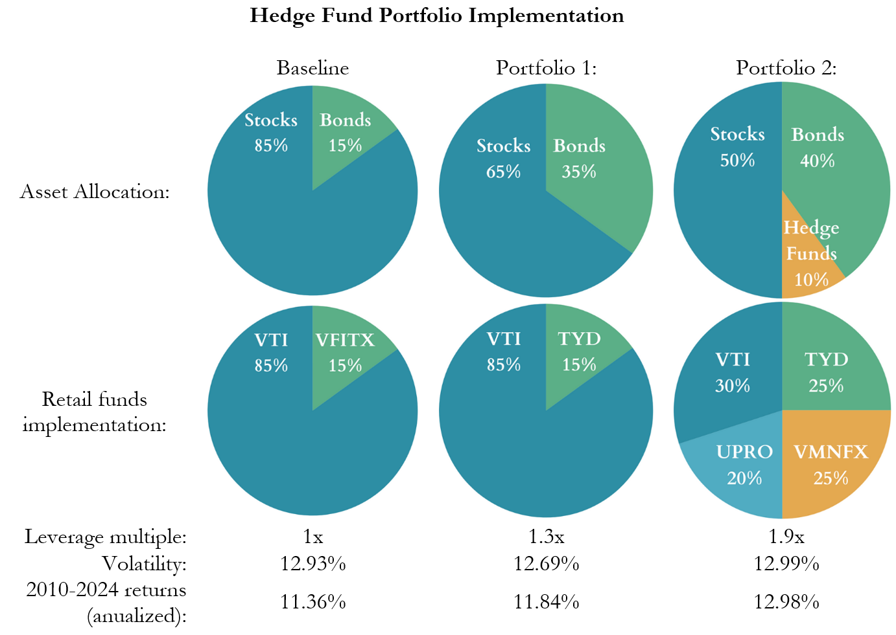

Since the start of the year, the S&P 500 is up over 8%, multi-strategy has cemented its place in the hedge fund world, and Bitcoin has returned to its all-time highs. What do you need to know in this environment to make smart investing decisions?  

The good news is probably nothing. Default investments like target date funds or a standard diversified portfolio are sophisticated and sound. That being said, it’s fun to dig into the details so let’s take a look at what happened in 2023 and see what analysts are predicting for the future.

At the start of 2023, the outlook was negative. The S&P 500 had lost 20% the year prior, inflation was at 6.2%, and the consensus predicted a recession at some point in the year. However, 2023 ended up being a banner year in the markets with the S&P delivering a surprising 24% return.  

Predictions for 2024 are based on continuing good news for inflation. The Fed raised interest rates higher and faster in 2023 than people predicted, and yet economic growth continued. This was the surprising good news of 2023, and it accounted for a large part of the stock market returns. The analysis heading into 2024 has been that inflation will continue to come down, but that is already priced into the market.  

Interestingly, analysts still forecast a 45% chance of mild recession at the start of the year. Given that, here are 5 scenarios of how economic growth and inflation might drive both the stock and bond markets throughout the rest of the year:

The base case is that inflation continues to come down, the fed cuts rates, and this boosts both stocks and bonds. This is reflected by the highlighted bars in the center. The bars right of center reflects a situation where the market runs a bit hot - companies do well but inflation stops falling, prompting the Fed to keep rates high. Bonds fall in this scenario because they had already priced in 6 rate cuts at the start of the year. The bars left of center reflect the opposite scenario: inflation falls as expected, but the economy stops growing. At the start of the year this was predicted as about 45% likely, but just three months into the year most analysts have dropped that prediction. Inflation data has been mixed in these first few months, and no one is predicting the early, aggressive rate cuts any more. The right-of-center bars with higher equity returns and fixed income losses now look like the most likely outcome for the year. 

## Interlude: Bitcoin

I questioned myself about bitcoin again last week. I know it is a volatile, speculative asset, but it's hard not to feel like you're missing out when the gains are so rapid and shocking. I started seriously analyzing it as a financial instrument in March of 2021 when Morgan Stanley endorsed it as an option for its clients for the first time. The bank allowed an allocation of up to 2.5% of a portfolio, citing its non-correlation with traditional assets as a justification.  

Fast forward three years, and I still don’t have a position in Bitcoin. Digital currency seems to be the future, but it’s not clear what role Bitcoin or any other existing cryptocurrencies will have in that. From a statistical perspective, Bitcoin is not as attractive as it was in the past. At the time of Morgan Stanley’s announcement, Bitcoin had a low 0.15 correlation with equities. That is now up to 0.52. Worse, its volatility changes so much from year to year that it is hard to get reliable signals for a risk-managed portfolio.  

Even so, I don’t think a small allocation is unjustified. The market cap of Bitcoin amounts to 1% of the value of publicly traded companies globally, and it is reasonable to use that to guide a 1% portfolio allocation. On the statistical side, a 0.52 correlation isn’t terrible and its volatility appears to be converging to a predictable value. My wild guess is that Bitcoin, Ethereum, and other decentralized blockchains will play a secondary role to future Central Bank Digital Currencies, and will eventually settle into some boring pattern a bit below their current value. If you’re okay with that, or with the very imaginable chance of it falling to zero, then consider adding a 1% or 2% allocation.  

## Long-term predictions

Single year predictions can help make sense of why the market is behaving a certain way in real time, but long-term predictions provide a much better signal for portfolio allocation decisions. At the beginning of every year, investment research groups publish reports on market conditions for a variety of forward-looking time frames. Two of my favorite reports are the ones from [BlackRock](https://www.blackrock.com/institutions/en-us/insights/charts/capital-market-assumptions#assumptions) and [BNY Mellon](https://www.bnymellonwealth.com/insights/2024-capital-market-assumptions-the-path-to-normalization.html). The chart below contains the average of their predictions along with some historical information from Morningstar: 

What is most striking here is the forecast for U.S. versus international equities. These predictions show both that developed markets such as Europe and Japan, as well as emerging markets like Mexico and China will outperform U.S. stocks. On top of that, they are predicting that stocks in general will have lower than historical returns for the foreseeable future. Not all analysts predict underperformance by U.S. equities, but that is the aggregate consensus. There is much more to discuss here like the relationship between REITs and private real estate and different choices for bonds, but that will come in a future newsletter.  

## Decision points

So what should the average investor do with all this? The good news is, most likely nothing. The most helpful thing that annual predictions provide is the knowledge that there wasn’t some obvious scheme you could have followed to perfectly position yourself for whatever market craziness might come that year. If there is a big downturn you’ll hear all kinds of people come out of the woodwork showing how they predicted it, but don’t be fooled when it happens.  

Also, it’s worth a reminder that the past decade was unusually good for U.S. stocks. The figure below shows BNY Mellon’s prediction for U.S. Large Cap stocks from 2014 and how much the actual returns exceeded that prediction:

The takeaway here is to recalibrate our expectations and prepare for a future with lower returns in general. With all that in mind, here is unsolicited advice for 2024:  

1.	Feel confident maintaining your portfolio exactly as it was last year. A diversified set of funds with a volatility appropriate for your timeline is the core of good investing, as it always is. Discussions around active or passive funds, advisor or self-managed, or domestic vs international all amount to minor optimizations.  
2.	If you are interested in minor optimizations, incorporate some amount of international stock exposure in your portfolio if you aren’t doing so already. I’ll go into more detail in a future newsletter, but BNY Mellon and Fidelity use a roughly 60/30/10 breakdown for US/DM/EM allocations.  
3.	For even more optimizations, add hedge funds to your portfolio. When done properly this has added around 2% to aggregate annual returns historically and is standard practice for clients at places like Goldman Sachs and Morgan Stanley. There is a process to this that is a bit complicated to explain, but actually implementing it is straightforward. I’ll save a full explanation for a future time, but below is a glimpse into what it might look like.  

## Hedge funds

The word “hedge” in hedge fund means boring. That is the core purpose of hedging – to remove risk and make an investment more conservative. Hedging entails shorting some asset to remove the volatility it brings. Suppose you want to invest in AI so you buy some tech company stock. If you want to remove the risk of cryptocurrency exposure in those companies, you can short a specific amount of bitcoin to even things out. Now no matter how much bitcoin goes up or down, your investments remain unaffected.  

In fact, hedge funds should be thought of as a bond alternative. Low risk, low returns, and low correlation to stocks. The thing that makes them special is that they are a bond alternative that also has a low correlation to bonds. If you have two assets with similar risk/return profiles but no correlation to each other, you can combine them and lower the volatility without changing the returns. This is the “free lunch” in the old “diversification is the only free lunch in investing” maxim.[1] Conservative pension funds and endowments add hedge funds to their portfolios to reduce volatility while maintaining their expected returns; aggressive pension funds do this and add a carefully tailored amount of leverage to get back to the original volatility. Even Fidelity does a mild version of this in their target date funds.[2]

Here are some examples of implementing this with publicly available funds. The core idea is as follows:  
1.	Take a baseline portfolio with a volatility that makes you happy and add an additional diversifer to it.  
2.	This will lower both returns and volatility, but volatility will be lowered the most. The risk/reward ratio has improved but your returns are now lower than you want.  
3.	Now add exactly the right amount of leverage to bring the volatility up to the amount that made you happy in the first place. You now have the same volatility as you started with but higher returns.  

We’ll use a baseline portfolio of 85% stocks and 15% bonds, which is roughly the allocation in Fidelity’s 2050 target date fund. Portfolio 1 is the simplest possible example of following the steps above: it adds an extra allotment of bonds and then a small amount of leverage. Portfolio 2 adds hedge funds and then requires more leverage to bring it back up to baseline volatility.  

It is confusing at first glance why the pie chart amounts in the top row do not line up with the amounts in the bottom row. What we’re doing in these examples is using leveraged ETFs to get the correct leverage multiple, which requires pulling out a pocket calculator to keep the numbers straight. Portfolio 1 uses the leveraged ETF TYD, which is 10-year treasuries leveraged 3x. Thus $15 of TYD is the equivalent of $45 of treasuries. If you have $85 of stocks and $15 of TYD, then you have the equivalent of $130 of total assets, thus a 1.3x leverage multiple. This sounds more complicated than it is, and the point is that you can pick some amount of leveraged ETF that will give you the leverage multiple you are looking for.  

These are just quick examples to show what might be possible. The ideal implementation of this would include a multi-strategy approach to the hedge fund allocation and more efficient forms of leverage. In future newsletters we’ll discuss these factors and look at analyst commentary on perennial topics such as growth versus value, small cap versus large, and international versus domestic equities.  

Thanks for reading!  

[1] Not a direct quote, but a common paraphrase from Harry Markowitz’s 1952 “Portfolio Selection” paper. This concept is what people are referring to when they mention “Modern Portfolio Theory”, and it is simply the mathematical underpinning for the general advice of diversification.  

[2] I’m stretching things a bit here by claiming Fidelity’s target date funds incorporate a leveraged hedge fund strategy, but they do have a leverage multiple of 1.05x and include some hedge fund-like exposure in private real estate and commodities: https://fundresearch.fidelity.com/mutual-funds/composition/315792416
